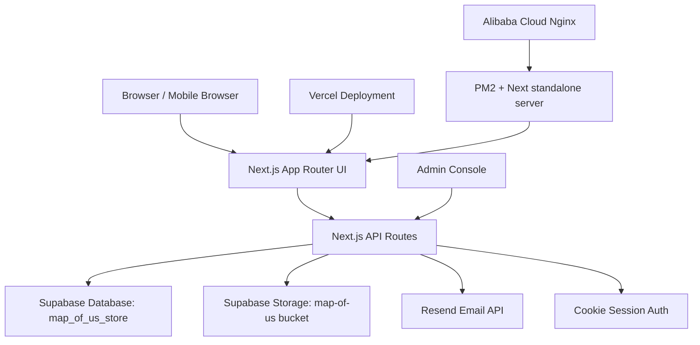

# Space of us - 下一会话交接文档

更新时间：2026-06-15  
项目目录：`C:\Users\31795\Documents\Map\map-of-us-template-main`

> 这份文档用于下次新会话快速加载上下文。不要把它当公开说明文档发布；它不记录明文密钥，但包含部署路径、分支和架构信息。

## 1. 快速定位

- 项目名称：`Space of us`
- 原始项目：`map-of-us-template-main`，由 `map-of-us-template-main.zip` 解压后改造
- 本地目录：`C:\Users\31795\Documents\Map\map-of-us-template-main`
- GitHub 仓库：`git@github.com:shen-szm/space-of-us.git`
- GitHub HTTPS：`https://github.com/shen-szm/space-of-us`
- 当前主要开发分支：`space-of-us-v3`
- 远端交付分支：`V3`
- Vercel 正式地址：`https://space-of-us.vercel.app`
- 阿里云临时 IP：`http://8.138.151.152`
- 阿里云部署目录：`/var/www/space-of-us`
- 阿里云运行方式：Ubuntu + Node.js 22 + PM2 + Nginx

## 2. 项目目标

把原来的地图纪念类 Next.js 项目改造成一个情侣空间网站，支持：

- 普通用户注册、登录、邮箱找回密码
- 管理员后台查看用户、重置密码、查看提醒
- 情侣绑定邀请，双方同意后正式绑定
- 情侣空间悬浮窗
- 约定、想吃想玩、旅游、美食菜单、奶茶饮品、订单
- 纪念日、地点收藏、回忆记录、时光宝盒
- 图片上传和存储空间告警
- 多设备登录后读取同一份云端数据
- 中国大陆更稳定访问，短期用阿里云轻量服务器，长期建议域名备案 + HTTPS

## 3. 关键决策

1. **分支隔离**
   - 原分支不直接继续修改。
   - V3 所有整理和修复进入 `space-of-us-v3`，推送到远端 `V3`。

2. **云端数据源**
   - 正式业务数据统一走 Supabase。
   - `localStorage/sessionStorage` 只保留临时 UI 状态或旧数据一次性迁移来源。

3. **账号体系**
   - 管理员账号独立存在，不在前台显式提示。
   - 普通用户使用 `用户名 + 密码` 登录。
   - 注册必须绑定邮箱，并通过图形验证码 + 邮箱验证码。
   - 找回密码流程是：邮箱验证通过后，才允许重置密码。
   - 已登录用户主动修改密码放在 `/settings` 的账号安全区。
   - 管理员后台保留帮用户重置密码。

4. **邮件服务**
   - 使用 Resend。
   - `RESEND_API_KEY` 只放环境变量，不写进代码。
   - `RESEND_FROM_EMAIL` 必须是合法发件格式，例如：
     - `onboarding@resend.dev`
     - 或 `"Space of us <onboarding@resend.dev>"`
   - 注意：之前 API Key 曾在聊天中出现过，后续稳定后建议在 Resend 控制台轮换一次。

5. **部署入口**
   - Vercel 目前是最稳定的线上参考版本，邮件功能在 Vercel 上已验证过可正常工作。
   - 阿里云用于改善中国大陆访问，但当前主要问题在静态资源/Nginx/standalone 部署配置，不是业务代码本身。
   - 没有域名前，阿里云只能用 IP 临时访问；长期应购买域名、备案、配置 HTTPS。

## 4. 已完成部分

### 4.1 桌面端探索

- 已解压原始 zip 到本地项目目录。
- 已执行依赖安装。
- 已尝试 Electron/electron-builder 打包。
- 因 Electron 下载、winCodeSign 解压、网络等问题，桌面端后来不再作为当前主线。
- Electron 能力保留，不作为 V3 当前首要交付标准。

### 4.2 网站改造

- 网站名称改为 `Space of us`。
- 删除旧作者联系方式、开源项目推广、GitHub Star 等旧内容。
- 侧边说明内容改为沈先生和张小姐的情侣空间语境。
- 登录界面改成 Apple 风格方向，左侧保留原始回忆照片氛围。
- 管理后台增加主站功能入口，并支持退出后台。
- 情侣空间改为更明显的悬浮入口，而不是角落小按钮。

### 4.3 功能模块

已保留或新增：

- 地图主页
- 情侣中心
- 情侣绑定邀请
- 回忆记录
- 地点收藏
- 纪念日
- 时光宝盒
- 情侣专属菜单
- 奶茶/美食预设
- 订单发送与完成状态
- 约定/想吃/想玩/旅游内容
- 系统设置
- 管理员后台

### 4.4 账号与认证

- 普通用户注册、登录、找回密码链路已多轮修复。
- 管理员登录保持独立。
- 新增邮箱字段：
  - `email`
  - `emailVerifiedAt`
  - `passwordUpdatedAt`
- 保留旧 `recoveryHash` 兼容字段，但不作为正式找回入口。
- 新增邮箱验证码和图形验证码。
- 修复过：
  - 注册后无法登录
  - 管理员可登录但普通用户不可用
  - 找回密码后新密码无法登录
  - 找回页一直显示“处理中”
  - 找回页底部不应显示情侣绑定模块
  - 邮箱重复提示中文化
  - 邮箱验证码 60 秒倒计时
  - 图形验证码按需显示

### 4.5 云端同步与存储

- Supabase 作为正式后端。
- 初始化 SQL 文件已准备。
- 主要业务数据改为通过 `/api/*` 读取和写入。
- 上传空间满额逻辑已设计并部分实现：
  - 用户上传时提示空间已满
  - 管理后台显示告警

### 4.6 GitHub / Vercel

- GitHub 仓库已建立。
- SSH 推送已打通。
- `V3` 分支已推送。
- Vercel 项目 `space-of-us` 已部署。
- Vercel 生产地址：`https://space-of-us.vercel.app`
- Vercel 上邮件发送功能曾正常验证。

### 4.7 阿里云

- 服务器已安装：
  - Node.js 22
  - npm
  - pm2
  - git
  - nginx
- 项目已 clone 到 `/var/www/space-of-us`
- 已 checkout `V3`
- 已安装依赖并成功 `npm run build`
- PM2 进程名：`space-of-us`
- Nginx 已反代到 `127.0.0.1:3000`

## 5. 整体架构思路



核心设计：

- 页面层只负责 UI 和交互。
- 所有正式数据都通过 API 路由进入服务端。
- 服务端统一处理：
  - 账号校验
  - 密码哈希
  - 邮箱验证码
  - 图形验证码
  - Supabase 读写
  - 上传容量检查
  - 管理员权限
- Supabase 里使用一个 key-value JSON 表承载项目数据，便于快速迭代。
- 文件图片走 Supabase Storage。
- Vercel 与阿里云部署读取同一套 Supabase 数据。

## 6. 重要文件与职责

### 根配置

- `C:\Users\31795\Documents\Map\map-of-us-template-main\package.json`
  - 脚本、依赖、项目名。
- `C:\Users\31795\Documents\Map\map-of-us-template-main\next.config.ts`
  - Next.js 配置，包含 standalone 输出。
- `C:\Users\31795\Documents\Map\map-of-us-template-main\CHANGELOG.md`
  - 每次更新必须记录。
- `C:\Users\31795\Documents\Map\map-of-us-template-main\docs\supabase-schema.sql`
  - Supabase 初始化 SQL。

### 页面与组件

- `C:\Users\31795\Documents\Map\map-of-us-template-main\app\page.tsx`
  - 首页入口。
- `C:\Users\31795\Documents\Map\map-of-us-template-main\components\EntryExperience.tsx`
  - 登录、注册、找回密码、情侣绑定入口的核心 UI。
- `C:\Users\31795\Documents\Map\map-of-us-template-main\components\SettingsExperience.tsx`
  - 设置页、账号安全、邮箱绑定/修改密码等。

### 账号与认证 API

- `C:\Users\31795\Documents\Map\map-of-us-template-main\app\api\auth\login\route.ts`
  - 管理员与普通用户登录。
- `C:\Users\31795\Documents\Map\map-of-us-template-main\app\api\auth\captcha\route.ts`
  - 图形验证码。
- `C:\Users\31795\Documents\Map\map-of-us-template-main\app\api\auth\email-code\route.ts`
  - 邮箱验证码发送与校验。
- `C:\Users\31795\Documents\Map\map-of-us-template-main\app\api\auth\password-recovery\route.ts`
  - 邮箱验证后的找回密码流程。
- `C:\Users\31795\Documents\Map\map-of-us-template-main\app\api\accounts\route.ts`
  - 注册、用户列表、管理员重置等。
- `C:\Users\31795\Documents\Map\map-of-us-template-main\app\api\account\security\route.ts`
  - 已登录用户账号安全设置。

### 共享数据 API

- `C:\Users\31795\Documents\Map\map-of-us-template-main\app\api\shared-items\route.ts`
  - 收藏、纪念日、时光宝盒等共享内容。
- `C:\Users\31795\Documents\Map\map-of-us-template-main\app\api\couple\route.ts`
  - 情侣空间、菜单、订单等。
- `C:\Users\31795\Documents\Map\map-of-us-template-main\app\api\account-binding\route.ts`
  - 情侣绑定邀请。
- `C:\Users\31795\Documents\Map\map-of-us-template-main\app\api\admin-alerts\route.ts`
  - 管理员提醒与容量告警。
- `C:\Users\31795\Documents\Map\map-of-us-template-main\app\api\login-photos\route.ts`
  - 登录页照片与文案配置。
- `C:\Users\31795\Documents\Map\map-of-us-template-main\app\api\memories\route.ts`
  - 回忆记录。
- `C:\Users\31795\Documents\Map\map-of-us-template-main\app\api\city-assets\route.ts`
  - 城市/地图资源。

### 服务端工具

- `C:\Users\31795\Documents\Map\map-of-us-template-main\lib\server\*`
  - Supabase 客户端、账号存储、邮件、验证码、权限等服务端工具。

## 7. 环境变量

生产环境必须有：

```env
AUTH_COOKIE_SECRET=
SITE_PASSWORD=
ADMIN_USERNAME=
ADMIN_PASSWORD=
SUPABASE_URL=
SUPABASE_SERVICE_ROLE_KEY=
SUPABASE_STORAGE_BUCKET=map-of-us
RESEND_API_KEY=
RESEND_FROM_EMAIL=
```

说明：

- `.env.production.local` 不应提交 Git。
- `SUPABASE_SERVICE_ROLE_KEY` 必须是 Supabase secret/service role key，不是 publishable key。
- `RESEND_FROM_EMAIL` 不要写成 `RESEND_FROM_EMAIL=RESEND_FROM_EMAIL=...`。
- 如果使用 Resend 测试发件，通常可先用 `onboarding@resend.dev`。
- 如果要自定义发件域名，必须先在 Resend 里验证域名。

## 8. 当前部署状态

### Vercel

- 状态：可作为线上参考版本。
- 地址：`https://space-of-us.vercel.app`
- 邮件：之前验证过可正常收发。
- 数据：连接 Supabase。

### 阿里云

- 状态：服务能启动，但页面静态资源加载异常。
- 现象：
  - 访问 `http://8.138.151.152` 时页面显示成未加载样式的纯 HTML。
  - `_next/static/chunks/*.css` 或部分 `.js` 出现 404/500。
  - 说明 PM2/Next 服务已响应，但 standalone 静态资源或 Nginx 静态资源路径仍需要修。
- 邮件：
  - 通过服务器上的 Node 脚本请求找回验证码接口，曾返回 `200` 和 `maskedEmail`，说明服务端邮件链路有成功迹象。
  - 注册时使用已存在邮箱会返回 `Email already exists`，这是预期行为，不是邮件错误。

## 9. 当前已知问题

1. **阿里云页面无样式**
   - 主要问题在 `_next/static` 静态资源没有正确被浏览器拿到。
   - 需要优先修 Nginx/standalone 资源目录。

2. **阿里云邮件发送体验不稳定**
   - Vercel 上邮件正常。
   - 阿里云可能受环境变量、Resend 发件地址格式或网络影响。
   - 需要用服务器端 API 直接测试注册/找回邮件。

3. **阿里云登录/注册异常**
   - 如果静态 JS/CSS 没加载完整，前端交互会异常。
   - 需要先解决静态资源，再验证登录注册。

4. **生产密钥安全**
   - Resend API Key 曾在对话中出现。
   - 项目稳定后建议重新生成 API Key，并更新 Vercel/阿里云环境变量。

## 10. 下一步待办

### P0 - 阿里云部署修复

- 修复 `_next/static` 资源路径。
- 确认 Nginx 能返回 CSS/JS 200。
- 清浏览器缓存或用无痕窗口验证。
- 确认页面恢复 Apple 风格 UI。

### P0 - 阿里云环境变量确认

- 确认 `.env.production.local` 每一行格式正确。
- 优先用 `npm run check:production-mail` 检查 Resend 运行时配置，脚本只输出是否存在和发件地址格式，不输出密钥。
- PM2 优先启动 `npm run start:production`，由 `scripts/start-production.mjs` 自动加载 `.env.production.local`，避免手动 `source` 后环境变量丢失。
- 确认运行时能读取：
  - `SUPABASE_URL`
  - `SUPABASE_SERVICE_ROLE_KEY`
  - `SUPABASE_STORAGE_BUCKET`
  - `RESEND_API_KEY`
  - `RESEND_FROM_EMAIL`

### P1 - 邮件链路验证

- 用新邮箱测试注册验证码。
- 用已有邮箱测试找回验证码。
- 检查 Resend Dashboard 是否有发送记录。
- 如果没有发送记录，重点查 API Key 和 from 格式。
- 如果有发送记录但收不到，查垃圾箱、Resend 测试发件限制、域名验证。

### P1 - 账号完整验证

- 注册一个新账号。
- 登录新账号。
- 找回密码并确认新密码可登录。
- 管理员登录后台查看新用户。
- 管理员重置密码后确认用户可登录。

### P2 - 长期上线

- 购买域名。
- 做备案。
- 配置 HTTPS。
- 将域名解析到阿里云。
- Nginx 增加 SSL 配置。

## 11. 阿里云部署备忘命令

### 11.1 更新代码

```bash
cd /var/www/space-of-us
git fetch origin
git checkout V3
git pull origin V3
```

### 11.2 重新安装与构建

```bash
cd /var/www/space-of-us
rm -rf .next
npm ci
npm run build
```

### 11.3 standalone 必要资源复制

```bash
cd /var/www/space-of-us
mkdir -p .next/standalone/.next
rm -rf .next/standalone/.next/static .next/standalone/public
cp -a .next/static .next/standalone/.next/static
cp -a public .next/standalone/public
```

### 11.4 启动 PM2

```bash
cd /var/www/space-of-us
pm2 delete space-of-us || true
PORT=3000 HOSTNAME=127.0.0.1 pm2 start npm --name space-of-us -- run start:production
pm2 save --force
```

启动前先检查邮件环境变量：

```bash
cd /var/www/space-of-us
npm run check:production-mail
```

如果 `RESEND_API_KEY` 或 `RESEND_FROM_EMAIL` 显示 `MISSING`，先修复服务器上的 `.env.production.local`，再重启 PM2。

### 11.5 推荐 Nginx 配置

文件：`/etc/nginx/sites-available/space-of-us`

```nginx
server {
    listen 80;
    server_name _;
    client_max_body_size 20m;

    location /_next/static/ {
        alias /var/www/space-of-us/.next/static/;
        access_log off;
        expires 1y;
        add_header Cache-Control "public, immutable";
        try_files $uri =404;
    }

    location /photos/ {
        alias /var/www/space-of-us/public/photos/;
        access_log off;
        expires 7d;
        add_header Cache-Control "public";
        try_files $uri =404;
    }

    location /favicon.ico {
        alias /var/www/space-of-us/public/favicon.ico;
        expires 7d;
        add_header Cache-Control "public";
    }

    location / {
        proxy_pass http://127.0.0.1:3000;
        proxy_http_version 1.1;
        proxy_set_header Host $host;
        proxy_set_header X-Real-IP $remote_addr;
        proxy_set_header X-Forwarded-For $proxy_add_x_forwarded_for;
        proxy_set_header X-Forwarded-Proto $scheme;
        proxy_set_header Upgrade $http_upgrade;
        proxy_set_header Connection "upgrade";
        proxy_cache_bypass $http_upgrade;
    }
}
```

启用：

```bash
ln -sf /etc/nginx/sites-available/space-of-us /etc/nginx/sites-enabled/space-of-us
rm -f /etc/nginx/sites-enabled/default
nginx -t
systemctl reload nginx
```

### 11.6 静态资源验证

```bash
curl -I http://127.0.0.1:3000
curl -s http://127.0.0.1:3000 | grep -o '/_next/static/chunks/[^"]*\.css' | head -n 1
curl -s http://127.0.0.1:3000 | grep -o '/_next/static/chunks/[^"]*\.js' | head -n 5
curl -I http://8.138.151.152/_next/static/chunks/0.rj8gl6k4_d1.css
pm2 logs space-of-us --lines 80
```

## 12. 本地验证清单

```powershell
cd C:\Users\31795\Documents\Map\map-of-us-template-main
npm run lint
npm run build
npm run dev
```

重点验证：

- 登录页 UI 正常。
- 注册页输入邮箱后才显示图形验证码。
- 获取邮箱验证码后显示 60 秒倒计时。
- 已存在邮箱显示：`该邮箱已被使用，请换一个。`
- 找回密码页发送验证码后不再卡在“处理中”。
- 找回页底部不显示情侣绑定模块。
- 邮箱验证码通过后才能输入新密码。
- 新密码可登录。
- 管理员后台能看到注册用户。
- 共享数据刷新后仍存在。

## 13. Git 交付流程

```powershell
cd C:\Users\31795\Documents\Map\map-of-us-template-main
git status
git checkout space-of-us-v3
git add .
git commit -m "..."
git push origin HEAD:V3
```

如果 HTTPS 推送失败，使用 SSH：

```powershell
git remote set-url origin git@github.com:shen-szm/space-of-us.git
git push origin HEAD:V3
```

## 14. 日志规则

用户明确要求：**每一次更新都要有日志记录**。

每次代码改动都应同步更新：

- `C:\Users\31795\Documents\Map\map-of-us-template-main\CHANGELOG.md`

推荐格式：

```md
## 2026-06-15 · V3.x.x 标题

- 修复：
- 新增：
- 部署：
- 验证：
```

## 15. 下一会话启动提示

建议新会话开头直接给 Codex：

```text
读取 C:\Users\31795\Documents\Map\map-of-us-template-main\NEXT_SESSION_HANDOFF.md，
继续 Space of us V3。当前重点是修复阿里云部署静态资源加载和邮件发送验证。
不要改 main，继续用 space-of-us-v3 / origin V3。每次改动都写 CHANGELOG.md。
```
