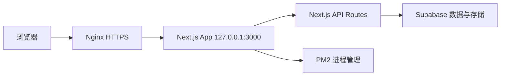

# Space of Us 项目交接文档 V3.4.1

更新时间：2026-06-17  
项目目录：`C:\Users\31795\Documents\Map\map-of-us-template-main`  
线上目录：`/var/www/space-of-us`  
线上域名：`https://space-of-us.online`、`https://www.space-of-us.online`

## 1. 项目定位

`Space of Us` 是一个情侣共享回忆空间，核心目标是把两个人的城市足迹、照片、纪念日、地点收藏、时光宝盒、情侣菜单和订单流整合到一个私密地图应用里。

当前产品风格方向：

- 视觉基调：奶白、莫兰迪、低饱和、温馨、轻雾面玻璃感。
- 信息组织：地图为主入口，右侧提供日期、天气、纪念日、进度、音乐推荐等轻量陪伴信息。
- 情侣功能：绑定后双方可以共享地图回忆、约定、菜单、订单和时光宝盒。
- 登录页方向：简约、温和、苹果系留白，不再堆砌说明卡片。

## 2. 当前版本与分支

- 当前前端版本常量：`V3.4.1`
- 版本文件：`lib/appVersion.ts`
- 本地开发分支：`space-of-us-v3`
- 远程部署分支：`V3`
- 常用推送命令：

```powershell
cd C:\Users\31795\Documents\Map\map-of-us-template-main
git status
git add .
git commit -m "chore: update project handoff"
git push origin HEAD:V3
```

注意：如果只想推送某次修复，建议只 `git add` 相关文件，不要把无关压缩包或临时文档一起提交。

## 3. 技术架构概览

### 3.1 前端与应用框架

- Next.js `16.2.6`
- React `19.2.4`
- App Router
- TypeScript
- CSS 变量主题系统
- `lucide-react` 图标
- `framer-motion` 动效
- `d3-geo` 地图投影相关能力

### 3.2 后端与数据

- Next.js API Routes 作为服务端接口层。
- Supabase 用作生产数据与图片存储。
- 本地或缺省场景下，部分 store 仍可通过 `lib/server/*Store.ts` 走本地 JSON 风格存储。
- 浏览器端不直接写 Supabase，所有关键写入都通过 `/api/*`。

### 3.3 部署架构



### 3.4 生产运行

- 服务器：阿里云 Ubuntu
- 进程管理：PM2
- 反向代理：Nginx
- HTTPS：Certbot / Let's Encrypt
- 生产启动脚本：`scripts/start-production.mjs`
- 生产环境变量文件：`.env.production.local`

## 4. 关键产品决策

### 4.1 版本与缓存

- 版本号统一从 `lib/appVersion.ts` 读取。
- 页面角标、需要 cache-bust 的静态资源，应统一复用版本常量。
- 避免多个组件手写不同版本号，导致浏览器看到不同页面状态。

### 4.2 主题系统

- 用户主题是个人偏好，不是情侣双方共享设置。
- 主题预设使用莫兰迪低饱和方案，不再使用高饱和多巴胺色。
- 主题通过 CSS 变量驱动，核心变量定义在 `app/globals.css` 与 `lib/themePresets.ts`。
- 主题选择保存在用户账号数据里，同时使用 localStorage 做即时切换。

当前主题预设：

- `cream-blush`：奶油粉雾
- `peach-sky`：蜜桃晴空
- `mint-cherry`：薄荷樱桃
- `butter-garden`：黄油花园

### 4.3 地图交互

- `/map` 首页全国地图应支持鼠标滚轮缩放。
- `/province/[id]` 省级内部地图不跟随滚轮缩放，避免和城市列表、弹窗滚动冲突。
- 省级地图继续保留按钮缩放、拖拽和平移。

### 4.4 情侣绑定与订单

- 绑定事实以 `/api/account-binding` 的账号绑定结果为准。
- `/api/couple` 用于情侣空间资料、菜单和订单流。
- 订单流目标为四步：
  1. 我发给 TA
  2. TA 接收或拒绝
  3. 发起方推进准备中或完成
  4. 双方看到最终状态与历史记录
- 解绑后默认保留历史内容和订单，但不允许继续写入旧情侣 scope。

### 4.5 首页右侧与随机内容

- 随机回忆图片播放保留在原位置。
- 音乐推荐卡放在首页右侧下方，替换原来的两个小人空态。
- 音乐推荐采用前端内置列表和外链跳转，不做站内播放，不接第三方音乐 API。

## 5. 已完成部分

### 5.1 基础部署与域名

- 阿里云服务器已能运行 Next.js 应用。
- Nginx 已配置反向代理到 `127.0.0.1:3000`。
- 域名 `space-of-us.online` 与 `www.space-of-us.online` 已绑定到服务器。
- HTTPS 已通过 Certbot / Let's Encrypt 配置成功。

### 5.2 邮件验证码

- 邮件发送服务使用 Resend。
- Resend 域名 `space-of-us.online` 已验证。
- 早期 403 测试邮箱限制与 422 `to` 字段格式问题已定位。
- 生产环境需要确保：
  - `RESEND_API_KEY` 正确
  - `RESEND_FROM_EMAIL` 为合法格式
  - 发件域名已在 Resend 验证

### 5.3 账号与注册

- 已有登录、注册、找回密码、邮箱验证码、图片验证码流程。
- 用户名规则已向中英文用户名方向调整。
- 主题偏好已接入账号安全设置。

### 5.4 地图与回忆

- 首页全国地图与省级地图结构已存在。
- 城市回忆、城市地标图、随机回忆卡已接入接口。
- 随机回忆卡保留在首页原位置。

### 5.5 情侣功能

- 情侣绑定、解绑、情侣空间、菜单、订单流都已有基本结构。
- 订单流已多轮调整，但仍需要用两个真实账号继续验收角色视角。

### 5.6 V3.4.1 最近完成的改动

最近一次代码修改重点：

- `components/RandomPhotoCard.tsx`
  - 默认导出继续只负责随机回忆卡。
  - 新增命名导出 `MusicRecommendationCard`。
  - 音乐推荐卡使用内置歌单和外链跳转。
  - 修复该组件内部分中文显示。

- `components/HomeProgress.tsx`
  - `StatsPanel` 引入并渲染 `MusicRecommendationCard`。
  - 首页右下角原两个小人区域改为音乐推荐。
  - 旧 `CoupleLogo` 保留为导出函数，但不再作为首页右下角默认内容。

验证结果：

- `npm run lint` 通过。
- `npm run build` 通过。

### 5.7 已安装技能

- 已安装 Codex skill：`pbakaus/impeccable`
- 安装位置：`C:\Users\31795\.codex\skills\impeccable`
- 注意：需要重启 Codex 后，技能列表里才会稳定可用。

## 6. 当前工作区状态

截至本交接文档创建前，工作区存在以下未提交内容：

```text
 M components/HomeProgress.tsx
 M components/RandomPhotoCard.tsx
?? docs/V3项目课堂答辩文档.md
?? space-of-us-v3-code-no-secrets.zip
```

处理建议：

- 如果要提交最近的首页音乐推荐修复，只提交：
  - `components/HomeProgress.tsx`
  - `components/RandomPhotoCard.tsx`
  - 本交接文档
- 不要默认提交 `space-of-us-v3-code-no-secrets.zip`。
- `docs/V3项目课堂答辩文档.md` 是否提交，取决于是否要把课堂答辩材料纳入仓库。

## 7. 重要文件索引

### 7.1 页面与布局

- `app/map/page.tsx`
  - 首页地图页。
  - 渲染全国地图、随机回忆卡、右侧统计面板。

- `components/ChinaMap.tsx`
  - 首页全国地图。
  - 负责省份展示、地图缩放、跳转省级页。

- `components/ProvinceMap.tsx`
  - 省级地图。
  - 负责城市列表、城市弹窗、地标上传、城市点亮。

- `components/HomeProgress.tsx`
  - 首页右侧信息栏。
  - 日期、天气、纪念日、进度、音乐推荐。

- `components/RandomPhotoCard.tsx`
  - 随机回忆卡。
  - `MusicRecommendationCard` 也在此文件中。

### 7.2 登录与设置

- `components/EntryExperience.tsx`
  - 登录、注册、找回密码、情侣绑定入口。

- `components/SettingsExperience.tsx`
  - 设置页。
  - 包含主题预设、账号安全、基础设置等。

- `components/ThemeController.tsx`
  - 主题读取、应用、同步。
  - localStorage key：`mapofus:theme-preset`
  - 事件：`mapofus:theme-preset-updated`

- `lib/themePresets.ts`
  - 主题预设定义。

### 7.3 情侣与共享内容

- `components/CoupleHub.tsx`
  - 情侣空间 UI。
  - 绑定总览、菜单、订单流。

- `components/MemoryTools.tsx`
  - 地点收藏、纪念日、时光宝盒。

- `components/MemoryNav.tsx`
  - 侧栏导航。
  - 显示版本号、灵感来源、赞助支持。

### 7.4 API 路由

- `app/api/account-binding/route.ts`
  - 情侣绑定与解绑。

- `app/api/couple/route.ts`
  - 情侣资料、菜单、订单。

- `app/api/city-assets/route.ts`
  - 城市地标图上传。

- `app/api/memories/route.ts`
  - 回忆数据。

- `app/api/shared-items/route.ts`
  - 地点收藏、纪念日、时光宝盒等共享内容。

- `app/api/account/security/route.ts`
  - 账号安全与主题偏好。

- `app/api/auth/*`
  - 登录、验证码、邮箱验证码、密码相关流程。

### 7.5 服务端存储

- `lib/server/accountStore.ts`
  - 账号、会话、主题偏好等持久化逻辑。

- `lib/server/coupleStore.ts`
  - 情侣空间数据持久化。

- `data/accounts.ts`
  - 账号数据结构定义。

### 7.6 部署与脚本

- `scripts/start-production.mjs`
  - 生产启动脚本。
  - 会加载 `.env.production.local`。

- `scripts/prepare-standalone.mjs`
  - standalone 资源准备历史脚本。

- `scripts/verify-start-production-assets.mjs`
  - 生产资源验证脚本。

- `scripts/check-production-mail.mjs`
  - 生产邮件配置检查脚本。

## 8. 环境变量

生产环境 `.env.production.local` 至少需要：

```bash
AUTH_COOKIE_SECRET=...
SITE_PASSWORD=...
ADMIN_USERNAME=...
ADMIN_PASSWORD=...
SUPABASE_URL=...
SUPABASE_SERVICE_ROLE_KEY=...
SUPABASE_STORAGE_BUCKET=map-of-us
RESEND_API_KEY=...
RESEND_FROM_EMAIL=...
```

注意：

- `.env.production.local` 不要提交到 GitHub。
- `RESEND_FROM_EMAIL` 必须是合法邮箱格式，例如 `Space of us <hello@space-of-us.online>`。
- Supabase service role key 只能放在服务端环境变量里。

## 9. 阿里云部署流程

推荐稳定流程：

```bash
cd /var/www/space-of-us
git pull origin V3

pm2 delete space-of-us
pm2 kill

ss -ltnp | grep ':3000'
# 如果仍看到 127.0.0.1:3000 被 next-server 占用，执行：
# kill -9 <PID>

rm -rf .next
npm config set registry https://registry.npmmirror.com
npm install --no-audit --foreground-scripts
npm run build

PORT=3000 HOSTNAME=127.0.0.1 pm2 start npm --name space-of-us -- run start:production
pm2 save --force
systemctl reload nginx

curl -I http://127.0.0.1:3000
curl -I https://space-of-us.online
pm2 describe space-of-us
```

### 9.1 为什么经常像“卡住”

主要原因有三类：

1. `npm ci` 或 `npm install` 依赖安装阶段输出少，看起来像没动。
2. `pm2 logs` 是持续监听日志，不会自动结束。
3. 旧 `next-server` 进程占用 `127.0.0.1:3000`，导致新 PM2 进程反复 `EADDRINUSE`。

### 9.2 遇到卡住时怎么处理

如果停在依赖安装：

```bash
Ctrl + C
npm cache clean --force
npm install --no-audit --foreground-scripts
```

如果进入 PM2 logs：

```bash
Ctrl + C
```

如果端口被占用：

```bash
pm2 delete space-of-us
pm2 kill
ss -ltnp | grep ':3000'
kill -9 <PID>
```

如果构建时报 `ENOTEMPTY` 或旧资源删不掉：

```bash
pm2 delete space-of-us
pm2 kill
ss -ltnp | grep ':3000'
kill -9 <PID>
rm -rf .next
npm run build
```

## 10. 待办事项

### P0：必须优先确认

- 登录页是否稳定显示登录表单，而不是只剩背景图。
- 服务器是否没有残留多个 `next-server` 占用 3000。
- 首页右下角是否已经是音乐推荐卡。
- 随机回忆卡是否仍保留在原位置。
- 不同浏览器强刷后是否都显示同一版本。

### P1：功能验收

- 两个真实账号测试情侣订单流：
  - A 发给 B
  - B 能看到接收 / 拒绝
  - B 接收后 A 能推进
  - 完成后双方都能看到历史
- 测试解绑：
  - 解绑入口可见
  - 解绑确认后双方状态刷新
  - 历史内容只读保留
- 测试城市上传：
  - 地标图上传
  - 回忆图片上传
  - 文字保存
  - 城市点亮
  - 随机回忆卡同步出现

### P2：体验继续打磨

- 登录页进一步按莫兰迪、苹果系留白审查。
- 主题切换后检查所有页面是否真正联动。
- 地点收藏与时光宝盒卡片继续优化空态与信息层级。
- 省级地图弹窗的上传错误提示继续细分。
- 移动端布局复查。

## 11. 下次新会话建议加载顺序

下次新会话建议先让 Codex 读取：

1. `PROJECT_HANDOFF_V3_4_1.md`
2. `git status --short`
3. `lib/appVersion.ts`
4. `components/EntryExperience.tsx`
5. `components/RandomPhotoCard.tsx`
6. `components/HomeProgress.tsx`
7. `components/ChinaMap.tsx`
8. `components/CoupleHub.tsx`
9. `components/ProvinceMap.tsx`

如果问题是部署相关，优先读取：

1. `scripts/start-production.mjs`
2. `package.json`
3. PM2 日志：`pm2 logs space-of-us --lines 80`
4. 端口占用：`ss -ltnp | grep ':3000'`

## 12. 当前风险提醒

- 线上缓存和 Next.js server action 版本不一致时，浏览器可能显示旧壳子或奇怪错误。部署后要关闭旧标签页重新打开，并强刷。
- PM2 删除不代表端口一定释放，必须用 `ss -ltnp | grep ':3000'` 查。
- 不要把多条部署命令连在一行执行，尤其是 `pm2 delete`、`pm2 start`、`curl`、`pm2 logs`。
- 不要提交 `.env.production.local`、压缩包、临时导出文件。
- `impeccable` skill 安装后需要重启 Codex 才能稳定使用。

## 13. 一句话给下次会话

当前重点不是继续大改 UI，而是先把 V3.4.1 线上状态彻底稳定：登录表单必须可见、随机回忆卡保留原位、音乐推荐在右下角、PM2 只保留一个进程、3000 端口没有残留旧服务，然后再继续情侣订单和上传链路的深度验收。
